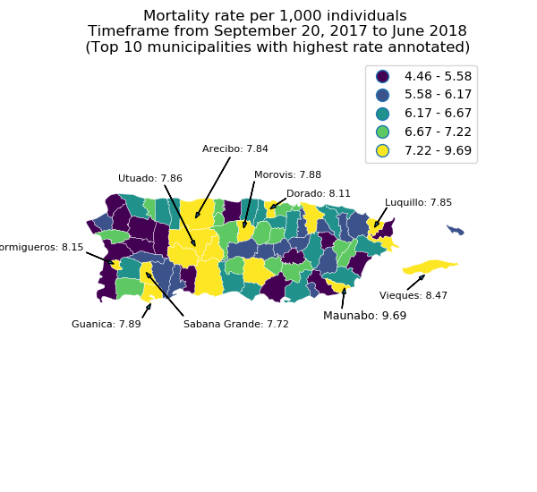
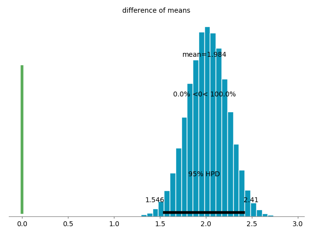

# Hurricane Maria Mortality Analysis
### by Ian Flores Siaca
**September 29, 2018**

## Context

Hurricane Maria struck Puerto Rico the 20th of September of 2017 at 6:15 a.m. entering through the municipality of Yabucoa as a Category 4 hurricane. According to the governments of Puerto Rico and the U.S. Virgin islands, the cost of the damage is estimated in $102 billion USD[1](https://www.wunderground.com/cat6/hurricane-maria-damages-102-billion-surpassed-only-katrina). However, the impact wasn't only economical. Following a lawsuit presented by the Center for Investigative Journalism (CPI, by its spanish initials) and CNN, the Government of Puerto Rico, and more specifically the Demographic Registry, was forced to publish the individual-level data of all the deaths occurred from September 20, 2017 to June 11, 2018. 

With access to this data we focused on answering two main questions. First, which municipalities in Puerto Rico need more aid to prevent deaths in the case of natural disasters? Second, which areas of the municipalities had higher death rates? This questions enable us with actionable insight to maximize aid and minimize the loss of life for future natural disasters.

## The Data

As previously mentioned, the main data source was the individual-level data of all the deaths in the island after the hurricane 
([Available Here](https://www.dropbox.com/s/k4wrb1ztwu0fwxh/Base%20de%20Datos%20Mortalidad%20en%20PR%20de%20septiembre%2018%20de%202017%20a%2011%20de%20junio%20de%202018%20entregada%20por%20Gobierno%20de%20PR%20al%20CPI.xls?dl=0)). It is worth noting that this dataset contains data that it's not confidential, but very sensitive as it contains all identifiable data such as names and addresses. 
I also used the *2017 Annual Estimates of the Resident Population* from the United States Census Bureau ([Available Here](https://factfinder.census.gov/bkmk/table/1.0/en/PEP/2017/PEPANNRES/0400000US72.05000)) to get the population estimates per municipality in 2017.

## The Analysis

To answer the first of our questions *Which municipalities in Puerto Rico need more aid to prevent deaths in the case of natural disasters?*, I decided that it was better to first standarize the data to be on a comparable scale and then visualize it to see if there were spatial patterns. I did this by calculating the death rate for each municipality. 

This maps highlights the top ten municipalities with the highest death rate. We see a spatial cluster of municipalities in the mountainous/central region of the island. We can observe as well that municipalities that are on the west coast of the island have a lower death rate than the other municipalities, this might be because they were the farthest from the Hurricane, but there might be other public policy possibilites as to why that is. 

Moving on to the second question, *Which areas of the municipalities had higher death rates?* I wanted to compare the death rate in urban areas with the death rate in rural areas, see if it was significant, but allow for a greater variability as a urban area in the north part of the island is not very similar to an urban area in the central part of the island. Given this reasons, I opted to estimate the death rate in urban and rural areas and compare this estimates. It is worth noting that the categories of rural and urban are assigned by the Department of Health of Puerto Rico. 

This estimates yielded an average mean of 1.98 with a confidence interval of 1.55 and 2.41. What this means is that on average 2 more persons died in rural areas than in urban areas. However, which rural areas might need more focus after another natural disaster? In the table below I present the top 10 municipalities with the highest **rural** death rate. 

<table>
<thead>
<tr><th style="text-align: right;">  </th><th>Municipality  </th><th>Zone  </th><th style="text-align: right;">  Number of Deaths</th><th style="text-align: right;">  Population (2017)</th><th style="text-align: right;">  Death Rate per 1000 individuals</th></tr>
</thead>
<tbody>
<tr><td style="text-align: right;"> 0</td><td>GUANICA       </td><td>RURAL </td><td style="text-align: right;">               111</td><td style="text-align: right;">              16363</td><td style="text-align: right;">                          6.7836 </td></tr>
<tr><td style="text-align: right;"> 1</td><td>SAN SEBASTIAN </td><td>RURAL </td><td style="text-align: right;">               242</td><td style="text-align: right;">              37306</td><td style="text-align: right;">                          6.48689</td></tr>
<tr><td style="text-align: right;"> 2</td><td>VIEQUES       </td><td>RURAL </td><td style="text-align: right;">                55</td><td style="text-align: right;">               8669</td><td style="text-align: right;">                          6.34445</td></tr>
<tr><td style="text-align: right;"> 3</td><td>LARES         </td><td>RURAL </td><td style="text-align: right;">               162</td><td style="text-align: right;">              25772</td><td style="text-align: right;">                          6.28589</td></tr>
<tr><td style="text-align: right;"> 4</td><td>AGUADILLA     </td><td>RURAL </td><td style="text-align: right;">               320</td><td style="text-align: right;">              53164</td><td style="text-align: right;">                          6.01911</td></tr>
<tr><td style="text-align: right;"> 5</td><td>RINCON        </td><td>RURAL </td><td style="text-align: right;">                85</td><td style="text-align: right;">              14128</td><td style="text-align: right;">                          6.01642</td></tr>
<tr><td style="text-align: right;"> 6</td><td>LAS MARIAS    </td><td>RURAL </td><td style="text-align: right;">                50</td><td style="text-align: right;">               8402</td><td style="text-align: right;">                          5.95096</td></tr>
<tr><td style="text-align: right;"> 7</td><td>NARANJITO     </td><td>RURAL </td><td style="text-align: right;">               161</td><td style="text-align: right;">              28306</td><td style="text-align: right;">                          5.68784</td></tr>
<tr><td style="text-align: right;"> 8</td><td>CAMUY         </td><td>RURAL </td><td style="text-align: right;">               180</td><td style="text-align: right;">              31732</td><td style="text-align: right;">                          5.67251</td></tr>
<tr><td style="text-align: right;"> 9</td><td>LAJAS         </td><td>RURAL </td><td style="text-align: right;">               129</td><td style="text-align: right;">              22929</td><td style="text-align: right;">                          5.62606</td></tr>
</tbody>
</table>

If we are to focus on the **urban** areas, this would be the top 10 municipalities with the highest **urban** death rate:

<table>
<thead>
<tr><th style="text-align: right;">  </th><th>Municipality  </th><th>Zone  </th><th style="text-align: right;">  Number of Deaths</th><th style="text-align: right;">  Population (2017)</th><th style="text-align: right;">  Death Rate per 1000 individuals</th></tr>
</thead>
<tbody>
<tr><td style="text-align: right;"> 0</td><td>SAN JUAN      </td><td>URBANO</td><td style="text-align: right;">              2531</td><td style="text-align: right;">             337288</td><td style="text-align: right;">                          7.50397</td></tr>
<tr><td style="text-align: right;"> 1</td><td>BAYAMON       </td><td>URBANO</td><td style="text-align: right;">              1174</td><td style="text-align: right;">             179565</td><td style="text-align: right;">                          6.53802</td></tr>
<tr><td style="text-align: right;"> 2</td><td>PONCE         </td><td>URBANO</td><td style="text-align: right;">               919</td><td style="text-align: right;">             140859</td><td style="text-align: right;">                          6.52425</td></tr>
<tr><td style="text-align: right;"> 3</td><td>CATANO        </td><td>URBANO</td><td style="text-align: right;">               150</td><td style="text-align: right;">              24374</td><td style="text-align: right;">                          6.1541 </td></tr>
<tr><td style="text-align: right;"> 4</td><td>CAROLINA      </td><td>URBANO</td><td style="text-align: right;">               866</td><td style="text-align: right;">             154489</td><td style="text-align: right;">                          5.60558</td></tr>
<tr><td style="text-align: right;"> 5</td><td>FAJARDO       </td><td>URBANO</td><td style="text-align: right;">               166</td><td style="text-align: right;">              31324</td><td style="text-align: right;">                          5.29945</td></tr>
<tr><td style="text-align: right;"> 6</td><td>CAGUAS        </td><td>URBANO</td><td style="text-align: right;">               641</td><td style="text-align: right;">             129604</td><td style="text-align: right;">                          4.94584</td></tr>
<tr><td style="text-align: right;"> 7</td><td>GUAYNABO      </td><td>URBANO</td><td style="text-align: right;">               422</td><td style="text-align: right;">              87328</td><td style="text-align: right;">                          4.83236</td></tr>
<tr><td style="text-align: right;"> 8</td><td>MAYAGUEZ      </td><td>URBANO</td><td style="text-align: right;">               335</td><td style="text-align: right;">              75525</td><td style="text-align: right;">                          4.43562</td></tr>
<tr><td style="text-align: right;"> 9</td><td>TOA BAJA      </td><td>URBANO</td><td style="text-align: right;">               287</td><td style="text-align: right;">              78092</td><td style="text-align: right;">                          3.67515</td></tr>
</tbody>
</table>

However, on an island with a limited budget and a complex public health system segregating between rural and urban areas might not be the most important factor in determining where to impact. With this last table, we can visualize the top 10 zones in the island with the highest death rate.

<table>
<thead>
<tr><th style="text-align: right;">  </th><th>Municipality  </th><th>Zone  </th><th style="text-align: right;">  Number of Deaths</th><th style="text-align: right;">  Population (2017)</th><th style="text-align: right;">  Death Rate per 1000 individuals</th></tr>
</thead>
<tbody>
<tr><td style="text-align: right;"> 0</td><td>SAN JUAN      </td><td>URBANO</td><td style="text-align: right;">              2531</td><td style="text-align: right;">             337288</td><td style="text-align: right;">                          7.50397</td></tr>
<tr><td style="text-align: right;"> 1</td><td>GUANICA       </td><td>RURAL </td><td style="text-align: right;">               111</td><td style="text-align: right;">              16363</td><td style="text-align: right;">                          6.7836 </td></tr>
<tr><td style="text-align: right;"> 2</td><td>BAYAMON       </td><td>URBANO</td><td style="text-align: right;">              1174</td><td style="text-align: right;">             179565</td><td style="text-align: right;">                          6.53802</td></tr>
<tr><td style="text-align: right;"> 3</td><td>PONCE         </td><td>URBANO</td><td style="text-align: right;">               919</td><td style="text-align: right;">             140859</td><td style="text-align: right;">                          6.52425</td></tr>
<tr><td style="text-align: right;"> 4</td><td>SAN SEBASTIAN </td><td>RURAL </td><td style="text-align: right;">               242</td><td style="text-align: right;">              37306</td><td style="text-align: right;">                          6.48689</td></tr>
<tr><td style="text-align: right;"> 5</td><td>VIEQUES       </td><td>RURAL </td><td style="text-align: right;">                55</td><td style="text-align: right;">               8669</td><td style="text-align: right;">                          6.34445</td></tr>
<tr><td style="text-align: right;"> 6</td><td>LARES         </td><td>RURAL </td><td style="text-align: right;">               162</td><td style="text-align: right;">              25772</td><td style="text-align: right;">                          6.28589</td></tr>
<tr><td style="text-align: right;"> 7</td><td>CATANO        </td><td>URBANO</td><td style="text-align: right;">               150</td><td style="text-align: right;">              24374</td><td style="text-align: right;">                          6.1541 </td></tr>
<tr><td style="text-align: right;"> 8</td><td>AGUADILLA     </td><td>RURAL </td><td style="text-align: right;">               320</td><td style="text-align: right;">              53164</td><td style="text-align: right;">                          6.01911</td></tr>
<tr><td style="text-align: right;"> 9</td><td>RINCON        </td><td>RURAL </td><td style="text-align: right;">                85</td><td style="text-align: right;">              14128</td><td style="text-align: right;">                          6.01642</td></tr>
</tbody>
</table>

## Conclusion

In a context of climate change and a worsening economic crisis, Puerto Rico's organizations (Government and NGO's) need to improve their preparedness and their plans of action to fit the economic and infrastructure constrains present to be able to effectively save lives and maximize aid. There's been a lot of talk as to how the organizations should act upon on times of crisis, however, without data from previous disasters we are merely speculating as to which processes happened and how they happened. This analyses shows that more focus needs to be turned into the rural areas of the island as those are the ones with a higher death rate. Not only this, but remote and hard-to-access locations such as the mountainous region need to be aided with greater efficency as this ones as well suffered higher death rates. 

## References 

1. https://www.wunderground.com/cat6/hurricane-maria-damages-102-billion-surpassed-only-katrina
