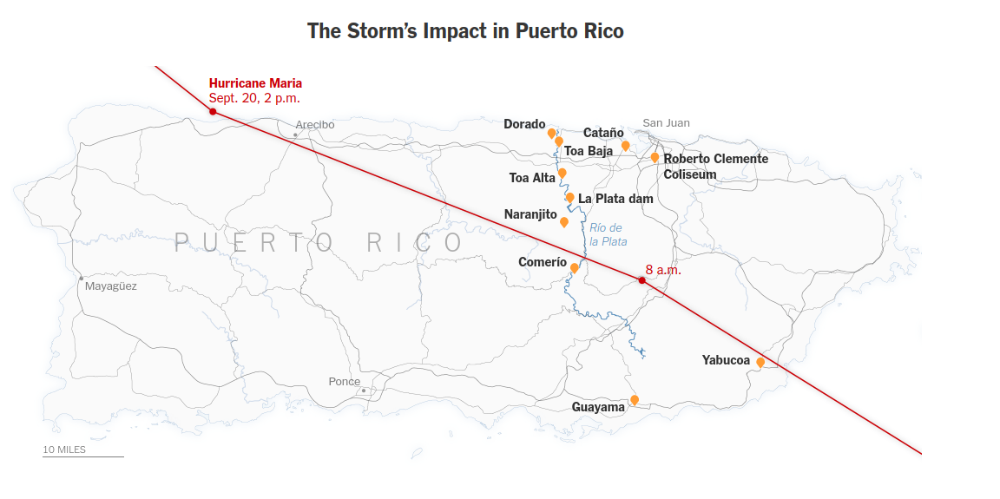
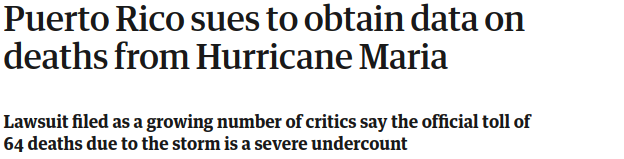
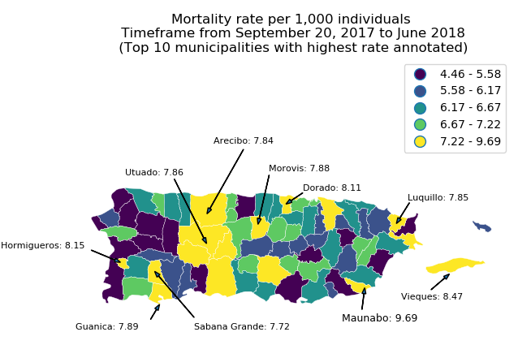

```{r setup, include=FALSE}
options(htmltools.dir.version = FALSE)
```

### Destroyed houses after Hurricane Maria


Image credit: [TIME](https://timedotcom.files.wordpress.com/2017/10/andres-kudacki-puerto-rico-hurricane-maria-21.jpg)

---
class: inverse, center

### Hurricane Maria's Trajectory


Image credit: [New York Times](https://www.nytimes.com/interactive/2017/09/18/world/americas/hurricane-maria-tracking-map.html)
---
class: left

### Questions

### 1) Which municipalities in PR should prioritize their emergency response plan revision to prevent fatalities in case of future natural disasters?

### 2) Which type of municipal zone, urban or rural, had higher mortality rates?

---
class: inverse, center, middle

# The Data

---
class: left, middle

### Lawsuit for Mortality Data

[The Guardian](https://www.theguardian.com/world/2018/jun/01/puerto-rico-sues-to-obtain-data-on-deaths-from-hurricane-maria)



[CNN](https://www.cnn.com/2018/06/12/politics/sutter-records-release-puerto-rico-invs/)


---
class: left

### Data Sources

* The main data source is the individual-level mortality data obtained from the lawsuit.
    * Detailed personal information for each deceased individual
    * The type of municipal zone specified in the data is given by the Department of Health of Puerto Rico.
    * Data from September 20, 2017 up to June 11, 2018
    * [Link to access the data](https://www.dropbox.com/s/k4wrb1ztwu0fwxh/Base%20de%20Datos%20Mortalidad%20en%20PR%20de%20septiembre%2018%20de%202017%20a%2011%20de%20junio%20de%202018%20entregada%20por%20Gobierno%20de%20PR%20al%20CPI.xls?dl=0)
* 2017 Annual Estimates of the Resident Population
    * Estimated by the US Census Bureau
    * [Link to access the data](https://factfinder.census.gov/bkmk/table/1.0/en/PEP/2017/PEPANNRES/0400000US72.05000)

---
class: inverse, center, middle

# The Analysis and Results

---
class: left

### Which municipalities in PR should prioritize their emergency response plan revision to prevent fatalities in case of future natural disasters?

* Mortality rate per municipality
* Stratify by percentiles



---
class: left

### Which type of municipal zone, urban or rural, had higher mortality rates?

* Bayesian estimation of the mortality rate per zone


---
class: left

### Which type of municipal zone, urban or rural, had higher mortality rates?

** Rural overall estimated mortality rate: 4.12 with 1.21 standard deviation **

<div class="center">
<h4> Top 5 municipalities with the highest rural mortality rate </h4>
```{r, warning=FALSE, echo=FALSE}
rural <- read.csv("https://raw.githubusercontent.com/ian-flores/Hurricane_Maria_Mortality_Analysis/master/analysis/data/rural/percentile_100.csv")
rural$X <- NULL
colnames(rural)[4] <- "Population" 
colnames(rural)[5] <- "Mortality Rate"
rural$ResidenceZone <- NULL
rural['Mortality Rate'] <- round(rural['Mortality Rate'], 2)
knitr::kable(head(rural, n = 5), format = 'html')
```
</div>

---
class: left

### Which type of municipal zone, urban or rural, had higher mortality rates?

** Urban overall estimated mortality rate: 2.14 with 1.06 standard deviation **

<div class="center">
<h4> Top 5 municipalities with the highest urban mortality rate </h4>
```{r, warning=FALSE, echo=FALSE}
urban <- read.csv("https://raw.githubusercontent.com/ian-flores/Hurricane_Maria_Mortality_Analysis/master/analysis/data/urban/percentile_100.csv")
urban$X <- NULL
colnames(urban)[4] <- "Population" 
colnames(urban)[5] <- "Mortality Rate"
urban$ResidenceZone <- NULL
urban['Mortality Rate'] <- round(urban['Mortality Rate'], 2)
knitr::kable(head(urban, n = 5), format = 'html')
```
</div>

---
class: inverse, center, middle

# Takeaways

---
class: left

### Which municipalities in PR should prioritize their emergency response plan revision to prevent fatalities in case of future natural disasters?

#### Conclusions

* We observe a cluster of municipalities with high mortality rates in the mountainous/central region of the main Island. 

* Most of the municipalities that are on the west coast ranked in the lowest 20% of the mortality rates. This might be explained by the fact that the trajectory of the hurricane crossed thorugh the north-east and center part of the main Island

#### Limitations

* Time distribution of the individual fatalities
* Previous year municipality-level mortality data
* Even inside a same municipality there can be huge differences in mortality rates between different sectors or neighborhoods. 

---
class: left

### Which type of municipal zone, urban or rural, had higher mortality rates?

#### Conclusions

* On average, for every 1,000 persons, 4 persons died in rural zones and 2 persons in urban zones.

* The urban area of San Juan, which has the best health infrastructure, was the overall zone with the highest mortality rate in Puerto Rico.

#### Limitations

* Age structure of the municipalities
* Income distribution per municipality
* The definitions of municipal zones are assessed by the Department of Health but the guidelines are not easily available to corroborate the data. 

---
class: inverse, center, middle

# Thank You

---
class: left

## References 

### Data References

* [Mortality Data](https://www.dropbox.com/s/k4wrb1ztwu0fwxh/Base%20de%20Datos%20Mortalidad%20en%20PR%20de%20septiembre%2018%20de%202017%20a%2011%20de%20junio%20de%202018%20entregada%20por%20Gobierno%20de%20PR%20al%20CPI.xls?dl=0)

* [Census Data](https://factfinder.census.gov/bkmk/table/1.0/en/PEP/2017/PEPANNRES/0400000US72.05000)

### Model References

* [Bayesian estimation supersedes the T-Test](https://docs.pymc.io/notebooks/BEST.html)

### Image References
* [TIME](https://timedotcom.files.wordpress.com/2017/10/andres-kudacki-puerto-rico-hurricane-maria-21.jpg)
* [The Guardian](https://www.theguardian.com/world/2018/jun/01/puerto-rico-sues-to-obtain-data-on-deaths-from-hurricane-maria)
* [CNN](https://www.cnn.com/2018/06/12/politics/sutter-records-release-puerto-rico-invs/)
* [New York Times](https://www.nytimes.com/interactive/2017/09/18/world/americas/hurricane-maria-tracking-map.html)